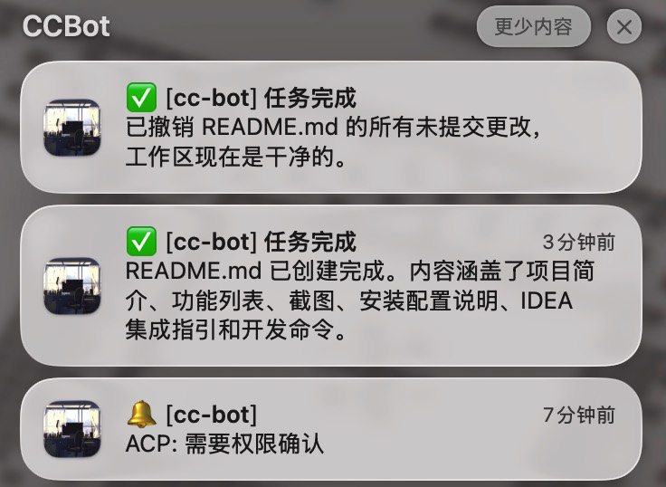
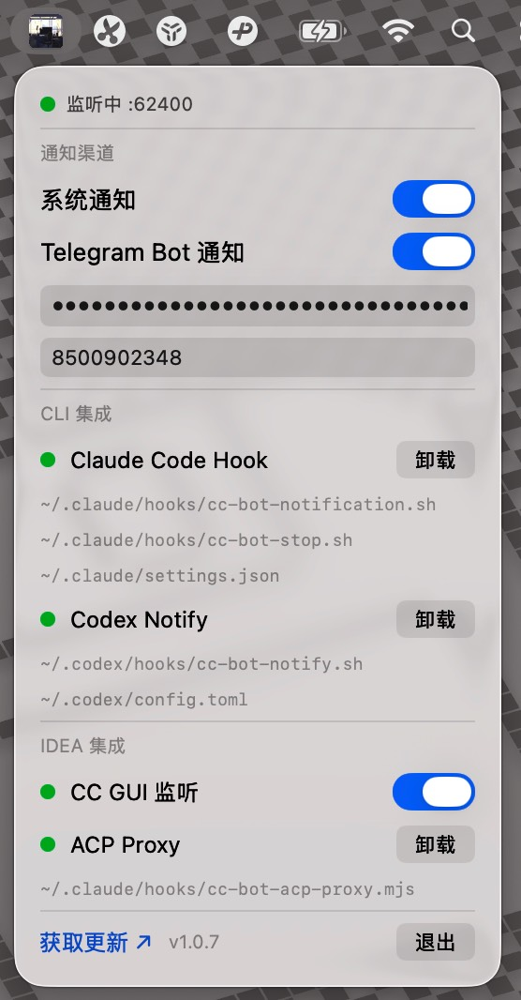

# CCBot

`Claude Code` / `Codex` 通知助手 — 通过 macOS `系统通知` 和 `Telegram Bot` 实时推送执行状态，不用再盯着 `CLI` 等结果。

<p align="center">
  
  
</p>

## 功能

- **系统通知** — 任务完成、需要确认时弹出 macOS 原生通知
- **Telegram Bot** — 同步推送到 Telegram，手机也能收到提醒
- **Codex Hook** — Codex 完成类事件走 `~/.codex/config.toml` 的 `notify`，审批类事件走 `~/.codex/hooks.json` 的 `PermissionRequest` hook
- **CC GUI 监听** — 监听 IDEA 等 JetBrains IDE 中 CC GUI 插件的权限请求，弹出通知
- **自动更新检查** — 启动后自动检查 GitHub Releases，24 小时内最多请求一次
- **菜单栏控制** — 一键开关各通知渠道、安装/卸载 Hook
- **原生系统样式** — 菜单栏界面使用 macOS 原生 `SwiftUI/AppKit` 控件，在不同 macOS 版本上会自动呈现对应系统风格

## 工作原理

```
Claude Code ──Hook──▶ HookServer(:62400) ──▶ 系统通知 / Telegram
Codex CLI ──notify / PermissionRequest──▶ HookServer(:62400) ──▶ 系统通知 / Telegram
CC GUI 插件 ──文件监听──▶ CCGUIWatcher ──▶ 系统通知 / Telegram
```

1. **HookServer** — 在本地 `62400` 端口启动 TCP 服务，接收 Claude Code Hook 发来的 JSON 请求
2. **Codex Hook Installer** — 写入 Codex 脚本，更新 `~/.codex/config.toml`、`~/.codex/hooks.json`，把完成/交互提醒和审批提醒都接入本地 HookServer
3. **CCGUIWatcher** — 监听 CC GUI 插件的文件系统 IPC 目录，检测权限请求文件

## 安装

### 下载安装

从 [Releases](https://github.com/sunkz/cc-bot/releases) 页面下载最新 DMG，拖入 Applications 即可。

### 从源码构建

需要 Xcode 16+ 和 [XcodeGen](https://github.com/yonaskolb/XcodeGen)。

```bash
# 生成 Xcode 项目
./run.sh generate

# 构建并运行
./run.sh run

# 其他命令
./run.sh build    # 仅构建
./run.sh test     # 运行测试
./run.sh clean    # 清理构建产物
```

## 配置

启动后 CCBot 会常驻菜单栏，点击图标即可配置：

### Claude Code Hook

点击菜单栏中的 **安装** 按钮，CCBot 会自动：
- 写入 Hook 脚本到 `~/.claude/hooks/`
- 将 Hook 注册到 `~/.claude/settings.json`

### Codex Hook

点击菜单栏中的 **安装** 按钮，CCBot 会自动：
- 写入脚本到 `~/.codex/hooks/cc-bot-notify.sh`
- 写入脚本到 `~/.codex/hooks/cc-bot-permission-request.sh`
- 将 `notify = ["bash", ".../cc-bot-notify.sh"]` 写入 `~/.codex/config.toml`
- 在 `~/.codex/config.toml` 的 `[features]` 中写入 `hooks = true`
- 在 `~/.codex/hooks.json` 中注册 `PermissionRequest` hook，用于推送审批通知

### Telegram Bot

1. 通过 [@BotFather](https://t.me/BotFather) 创建 Bot，获取 Token
2. 获取你的 Chat ID（给 Bot 发消息后通过 API 查询）
3. 在菜单栏中填入 Bot Token 和 Chat ID

### IDEA 集成

#### CC GUI 监听

默认开启。监听 JetBrains IDE 的 CC GUI 插件权限请求目录，当出现权限确认时推送通知。

## 技术栈

- **Swift 6** + **SwiftUI** — macOS 13.0+
- **XcodeGen** — 项目文件生成
- **Network.framework** — TCP 服务器
- **UserNotifications** — 系统通知
- **DispatchSource** — 文件系统监听
- **GitHub Actions** — 自动构建、签名、公证、发布 DMG

## 许可

MIT
